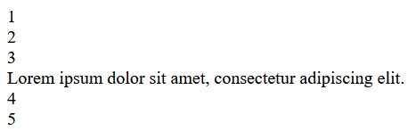
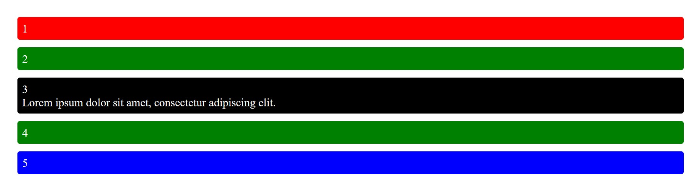
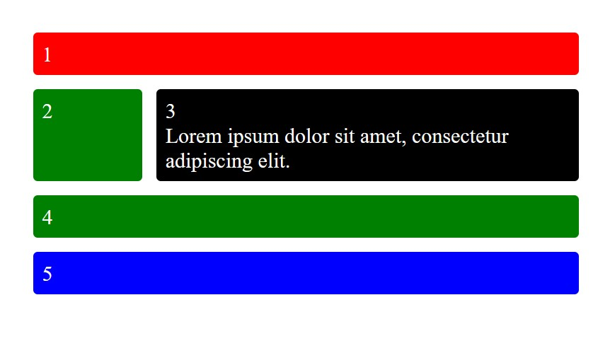
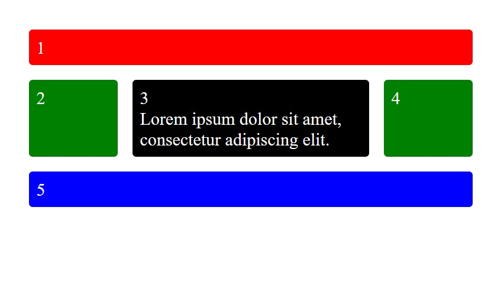

# Píldora Factoría F5 - Grid
Simone Ávila Arranz

## Descripción

Grid es algo conocido como grid based layout system, una técnica de diseño que organiza los elementos visuales en una estructura de filas y columnas, buscando coherencia, alineación, equilibrio y jerarquía visual. Funciona a través de la característica display: grid de CSS.

## Cómo utilizar Grid

### HTML

1. Crear un contenedor padre con la etiqueta div, añadir una clase.
Ej: "
 
"

4. Crear los hijos dentro con otros div, añadir clases individuales.
Ej: "
1
"

5. Añadir el contenido deseado, en este caso los números del 1 al 5 y un Lorem Ipsum corto.

### CSS

1. Añadir la característica grid-area a las clases de los hijos.
Ej: .uno {grid-area: uno;}

2. Añadir las características display: grid, grid-gap y grid-template-areas para establecer el grid, definir el espacio entre hijos y su orden, respectivamente. También personalizar como sea deseado. Ahora mismo el grid tiene una sola columna, más adelante utilizaremos media querys para adaptar el diseño a diferentes tamaños de pantalla.
Ej: .padre {.padre
    color: white;
    display: grid;
    grid-gap: 1em;
    grid-template-areas:
        "uno"
        "dos"
        "tres"
        "cuatro"
        "cinco"
    }

3. Personalizar las celdas.
Ej: .box {
    background-color: black;
    border-radius: 5px;
    padding: 10px;
    font-size: 150%; 
    }

.uno {
    background-color: red;
    }

.dos, .cuatro {
    background-color: green;
    }

.cinco {
    background-color: blue;
    }

4. Añadir media-query para que el diseño sea responsive en tablets y dispositivos móviles. Utilizar grid-template-columns y de nuevo grid-template-areas para establecer el número de columnas y el orden de los hijos, respectivamente.
Ej: @media only screen and (min-width: 600px)  {
    .padre {
        grid-template-columns: 20% auto;
        grid-template-areas:
        "uno uno"
        "dos tres"
        "cuatro cuatro"
        "cinco cinco";
    }
}

@media only screen and (min-width: 800px)   {
    .padre {
        grid-gap: 20px;
        grid-template-columns: 120px auto 120px;
        grid-template-areas:
        "uno uno uno"
        "dos tres cuatro"
        "cinco cinco cinco";
        max-width: 600px;
    }
}

